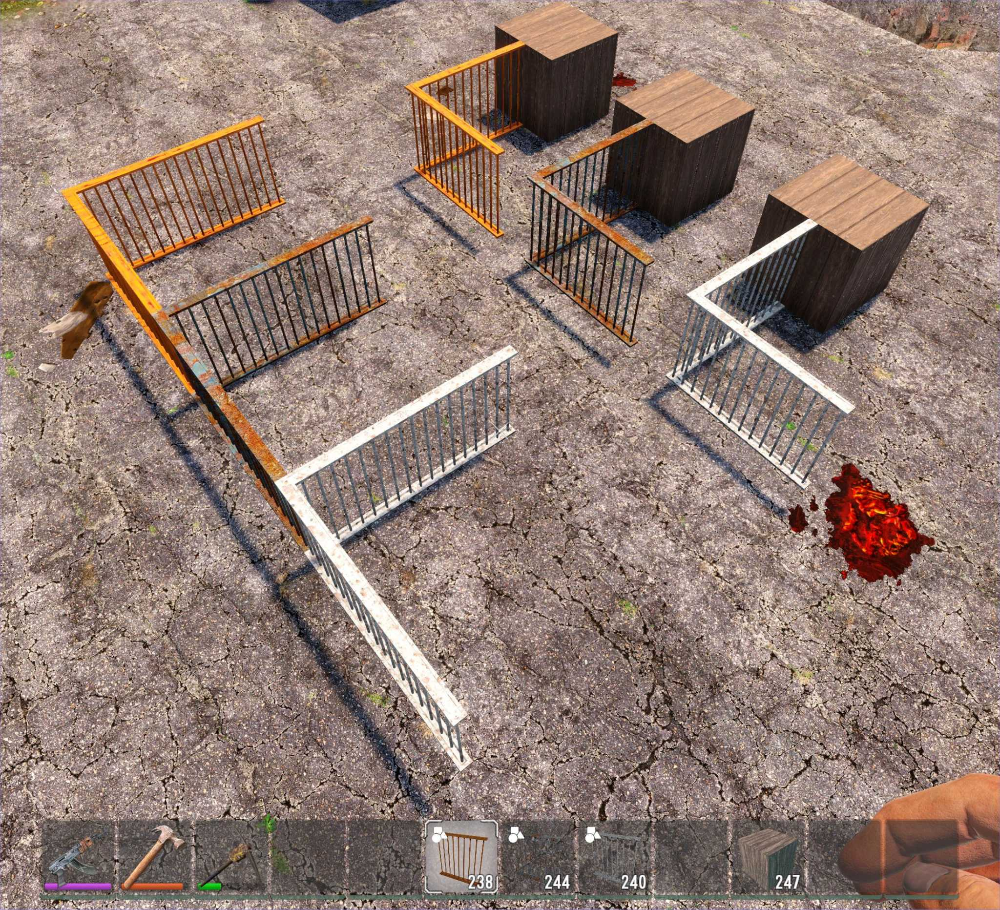
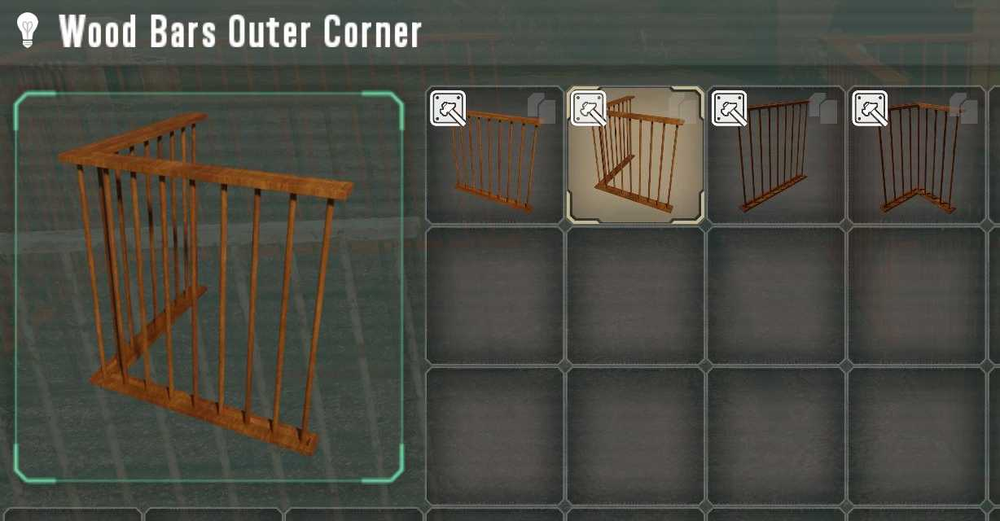
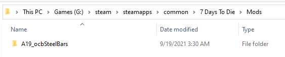
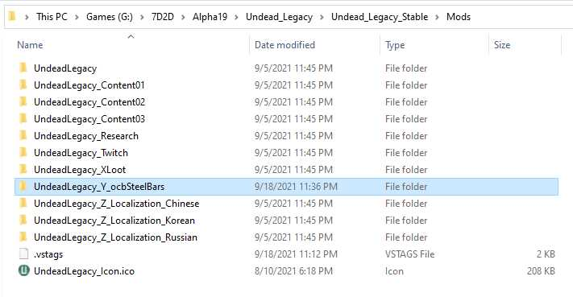

# OCB Steel Bars - 7 Days to Die and Undead Legacy Addon

Mod for [7 Days to Die][1] and [Undead Legacy][2], similar to [Xyths Steel Bar][3] mod.
As the original mod, this adds three types of bars to the game (wood, iron and steel) that you can
look, shoot and loot through. Additionally I've included a corner block for every material and there
is even a centered variant. In total adds 12 new building blocks to your game.

	
	
	
	 

In constrast to the original SteelBars addon, these blocks/meshes collide with bullets (of course
only where the actual bars and poles are). It should make it a bit more challenging to shoot through
bars and you can also damage them.

For discussions, please use the thread for this mod at the official 7 days to die forum:
https://community.7daystodie.com/topic/25320-new-steelbar-mod-with-undead-legacy-support

Please report issues and problems directly on GitHub:
https://github.com/mgreter/ocbSteelBars7D2D/issues/new

## Installing

If you downloaded the zip archive, you need to extract the mod into the `Mods` folder of your
7 days to die installation. This is e.g. found under `G:\steam\steamapps\common\7 Days To Die`.
The actual location can vary due to your steam settings where to install your games, but you should
be able to find the location in steam via game properties -> local files -> browse. I can also highly
recommend [7D2D Mod Launcher][15], to also easily get to your installation folder.

For undead legacy the folder name inside `Mods` is important, since it must be loaded after the base
undead legacy mod is loaded. The loading order is determined alphabetically, so don't rename it.

The final folder structure should resemble something like `7d2d\Mods\A19_ocbSteelBars\Config` etc. If
you copy the zip archive from here and save it into the `Mods` folder, be sure to choose `extract here`.

## Shape Helpers

All material variants are crafted via one single master block. You can only craft master blocks and
then, once equiped in your hot-bar, choose a variation by holding the reload key. This mod will
also remove the recipes for the original `WoodBars` and `IronBars` to cleanup the crafting UI. You
can edit (comment out) the corresponding lines at the bottom of the [recipe.xml][17] file to disable this.

## Building

Since I've ported this mod for the original 7 days to die and also for the undead legacy addon,
the mod comes in two flavours. Since the only differences are the block and recipe configs, we
build the final mod structure via a [simple batch script][18]. Currently only windows is supported, but
it should be very simple to adopt this to bash, since it only involves copying the correct files.
I will attach the archives for [every release I do on GitHub][16].

## Reporting Issues

Please report issues and problems via https://github.com/mgreter/ocbSteelBars7D2D/issues/new.

## License

This work is published under the [Creative Commons Attribution License][12]. All the work I did here,
I put under public domain, with the expection that I would like to be mentioned in the credits if you
want to include my work. This includes commercial (wink to TFP) and private purposes. With the additional
exception that the used textures are still attributed to the original authors (which are either governed
by the [Standard Unity Asset Store EULA][13] or public domain with attribution):

- Wood: https://assetstore.unity.com/packages/2d/textures-materials/wood/high-quality-realistic-wood-textures-mega-pack-75831
- Steel: https://3dtextures.me/2016/09/29/metal-rusted-007/

Unfortunately the iron texture from the [original SteelBars mod][14] (by Xyth) does not have any
license attached. I'm using them in terms of fair-use, but the actual license is unclear and may
need to be clarified if you want to re-use it.

## Known Issues

The repair cost for steel should not include forged iron (iron plating), but I did not find out
how to disable this, even though I added an explicit requirement for zero of these items to repair.
I also tried to remove the xml node via xpath remove query, but to no avail. So for now you also
need iron to repair steel bars.

## Localizations/Translations

I haven't done any translations yet, although I could probably copy some from the original SteelBars mod.
I could also easily do the german ones, since I'm native german speaker, but just haven't had time to.
If you want to contribute some translations, feel free to create a pull request at this [github repo][11].

## Developer resources and some insights

I included the blender and unity project files, hoping they are useful to other people. It took me around
the equivalent of a work week (40h) to get from not having unity or blender installed to having the first
final working version. Didn't even know that unity is that freely available for people to experiment with
and Blender was always a beacon in the OSS world. So most of the time was spent in learning how to use
blender and unity, but I may have to note that I already had a fair understanding how 3D programming
works in general, but I haven't used unity or blender before.

Xyth has put together a nice [collection of tools][4], which I've used to get this mod started.

First I simply tried to alter the existing SteelBars mod, but soon realized that this would be impossible
if I wanted to add the additional corner shapes. In order to do that I had to create my own models from
scratch, which turned out more complicated than I thought, since I'm a total noob when it comes to blender.

First day was mostly spent to learn how to export a simple cube from blender to unity to include in the
game. Once I had the block visually in the game, I realized I could simply walk through it and not interact
with it. I already knew that this probably had to do with the tagging system (T_Mesh etc). So the second
day I mostly spent to learn how the [unity colliders and the tags][6] work, or at least which ones work for me.

Once I had that [workflow covered][7], I had to create the actual models for the blocks. First I tried to do this
in blender completely, but I soon abandoned that idea, since every time I wanted to alter some detail, like
how big the dent on the handle bar is, I had to alter multiple vertices, which turned out to be impracticable.
I simply not know blender well enough to pull this off, but since I know how to code, I wrote two very simple
perl scripts to generate the required models with a few parameters, which I then could import in blender.

These models (exported as wavefront obj files) only contain the vertices and faces (quads). It's missing the
normals and UV coordinates, which need to be re-calculated and unwrapped in blender. Additionally I added
some Bevel modifiers to the top/bottom bars, to make them a bit more smooth. The normals are re-calculated
from the outside faces of the mesh (Shift+N); but make sure to check that all are correctly set. The UVs
are currently simple cube projections for the top/bottom bars. The poles are projected from the front views.

From blender the four models are [exported via fbx][5] to unity. There I first create the colliders for each
model from 2 or 4 [box colliders][6] (for the top/bottom bars) and one [mesh collider][6] (for the poles). Once
this worked for one variant (e.g. wood), I created the other variants (iron and steel), which means I
simply changed the used material on each model. The nice thing about this [fbx export approach][7] is, that
I can simply refresh the imported fbx to update the models in every variant (including the mesh collider).

Once [everything is set in unity][8], simply [export via the MultiPlatformExportAssetBundles.cs script][9],
which is included in the template provided by Xyth (thanks a lot for that!). If you open this repo the first
time in unity, be sure to load the scene included in the assets to see something ;) Prefabs can be created
by drag and droping the folder from the hierarchy to the project assets folder (preferably the Prefab folder).

### Open questions and further improvements

I think I could figure out most stuff, but some parts are still a bit mysterious. I couldn't really figure
out what the different tags mean, e.g. the difference between `T_Mesh`, `B_Mesh` and `T_Mesh_B`, `T_Block`.
Unfortunately I couldn't really dig up any resource that would explain those in more detail. I guess using
a Mesh type is correct here, as we don't have a fully opaque block. But no idea what T or B stands for.
I've used `T_Mesh_B` for now (on the collider), since that seems to work as needed and wanted.

The metal textures look a bit dull if you look closely (mostly due to my UV unwrapping). I haven't yet put
much more time into it, but it seems to be a low hanging fruit to improve the visual apperance quite easily.

I'm still figuring out if the amount of harvested materials are fairly balanced. Hit-points and materials
needed for upgrading are mostly the same as for already existing similar blocks. I'm also very unsure how
the modifiers like `count="from,to"` or `prod` exactly influence the harvest drop.

The outer corner should realistically need double the materials to fabricate, since it is infact two outer edges
(the center corner doesn't have this issue, since it is the same length as the center or outer edge). But having
a different recipe for the outer corner would mean that we cannot include it in the same basic shape helper block.

The in-game icons for the iron material variation are a bit too dark.

Currently the outer and the center blocks work together, but connecting them is not really supported. There is
an opportunity to include much more specialized blocks, like an outer edge with center edge intersecting (T-shape).

### A note about in-game performance

I don't really know what the performance implications really are with this mod. I guess that the mesh collider
should have some performance costs, but I didn't see any significant fps drop with my rig (i9-9900k/GTX 1070 Ti).
I use 16 segments per pole-mesh, which could be reduced (in case this would improve performance).

### Changelog

- 0.2.2 - A19 recipes adjustments (20.09.2021)
  - Fixed resource costs for steel bars (was too low)
  - Added stone as another requirement (because why not)
  - Craft times and repair consts adjusted accordingly
- 0.2.1 - Bugfix release (20.09.2021)
  - Fixed iron-bars to be upgradable by steel-rebars (ULM)
- 0.2.0 - Initial beta release (18.09.2021)

[1]: https://7daystodie.com/
[2]: http://ul.subquake.com/download
[3]: https://community.7daystodie.com/topic/8400-xyths-a19-a17-modlet-collection/
[4]: https://community.7daystodie.com/topic/4396-creating-and-exporting-models-from-unity-for-use-in-7d2d/
[5]: screens/blender-fbx-export-settings.jpg
[6]: screens/unity-collider-settings.jpg
[7]: screens/unity-imported-fbx.jpg
[8]: screens/unity-structure-outline.jpg
[9]: screens/unity-exporting-prefabs.jpg
[10]: screens/unity-exported-prefabs.jpg
[11]: https://github.com/mgreter/ocbSteelBars7D2D/pulls
[12]: LICENSE
[13]: https://unity3d.com/legal/as_terms
[14]: https://github.com/7D2D/A19Mods/tree/master/SteelBars
[15]: http://7d2dmodlauncher.org/
[16]: https://github.com/mgreter/ocbSteelBars7D2D/releases
[17]: mods/ConfigA19/recipes.xml
[18]: build.bat